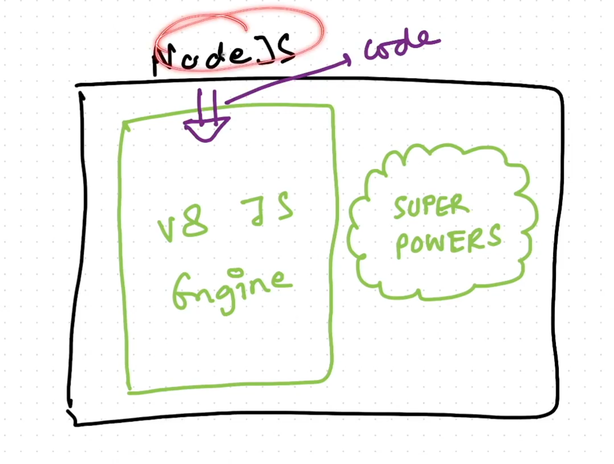
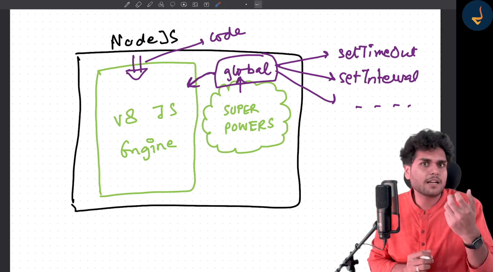
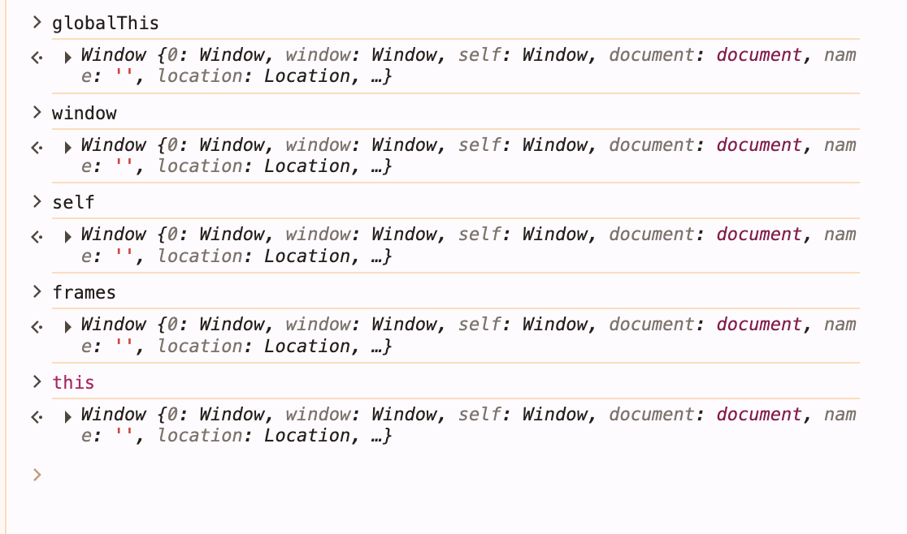

### Node js 
---
- Node js is a runtime environment that allows to build server side application with java script
- REPL 
  - Read
  - Evaluate
  - Print
  - Loop
#### Even Loop
- Simple Defination
   - The Event Loop is the mechanism that allows Node.js to handle multiple operations using a single thread.
   - Node js is a single threaded, non blocking and asyn in nature
   - what this means if i've to run 1000 api calls, dnb query a single thread won't works without frezing 
   - That where even loop comes
   - It has three core pieces
      - Call Stack
      - Web api/ Libuv (Node js c++ backend)
      - Callback queues
#### 1. Call Stack
- This is where js executes synchronously
- And i can understand stack works as a lifo 
- Example given below

```
function A() {
   console.log("A")
  B();
}

function B() {
   console.log("B")
  C();
}

function C() {
  console.log("C");
}

A();
```
- In this example output would be because callback stack look like below 
 ```
first A()->then console inside A -> then go inside B() -> console inside b -> go inside C() -> then console C 
 
A
B
C
```
- But what if I first call the funcion and then console will the output
differs or still be the same?

```
function A() {
  console.log("A");
  B();
}

function B() {
  console.log("B");
  C();
}

function C() {
  console.log("C");
}

A();

In this case execution order would be A() -> B() -> C() -> console log c -> came out of c and execute the 
console log b -> came out of b -> console log a

C
A
B
```
## Node js
- So Node js is a js runtime environment build on chrome's V8 engine plus somemore superpowers 
- Whenever we write a code that code is passed into v8 engine and v8 engine execute the code

- In browser there is a global object known as window, people thinks it's coming from v8 engine
- No it is given by browser
- In node js there is also global object and it's name is global
- So global is not inside v8 engine but inside nodejs given by nodejs
- It includes setTimeout, setInterval
- This is the one of superpower

- But console.log(this) or window will work in browser but not in node js and return empty object because global object is global inside node js 
- console.log(global) !== console.log(window or this or self or frames)
- Why all window or this or self or frames refering to same global objects in browser
- To standardise this in 2020 open js foundation that there should be same global object name in everywhere be it browser, node js, webworkes so they came up with common name 
- globalThis it'll work in everywhere 


### Common js modules (cjs) and Ecma Script modujes (mjs)
### Node.js Module Systems: CJS (Common JS Module) vs. (ESM ES Modules/ MJS)

- Common js module
  - module.export = functionC();
  - require('filename.js')
  - by deafult node uses cjs {type : "commonjs"}
  - older way of doing export import
  - sync means till the time require('filename.js') loads code will not go ahead
  - non strict mode
- ES Modules
  - to enable need to add {type : "module"} in package.json
  - export func abc, import {func name} from 'file name'
  - going forward this will become standard accoding to open js foundation
  - async means code will run even if the file is still loading
  - strict `mode` 

- What is module.export it's is empty object
- Module is a collection of code which is private to itself it exist seprately 
- We can access by module.exports then only we can access this inside other files
