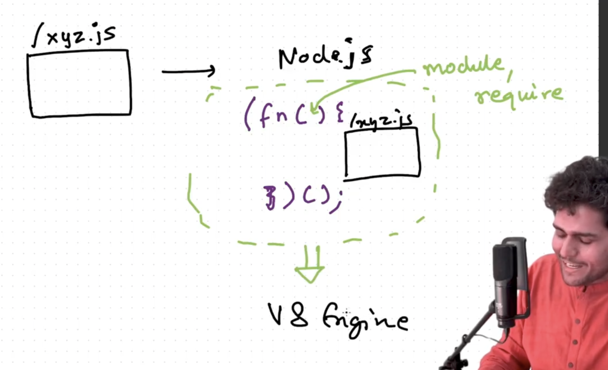

## Node js
- So Node js is a js runtime environment build on chrome's V8 engine plus somemore superpowers 
- Whenever we write a code that code is passed into v8 engine and v8 engine execute the code

- In browser there is a global object known as window, people thinks it's coming from v8 engine
- No it is given by browser
- In node js there is also global object and it's name is global
- So global is not inside v8 engine but inside nodejs given by nodejs
- It includes setTimeout, setInterval
- This is the one of superpower

- But console.log(this) or window will work in browser but not in node js and return empty object because global object is global inside node js 
- console.log(global) !== console.log(window or this or self or frames)
- Why all window or this or self or frames refering to same global objects in browser
- To standardise this in 2020 open js foundation that there should be same global object name in everywhere be it browser, node js, webworkes so they came up with common name 
- globalThis it'll work in everywhere 


### Common js modules (cjs) and Ecma Script modujes (mjs)

- Common js module
  - module.export = functionC();
  - require('filename.js')
  - by deafult node uses cjs {type : "commonjs"}
  - older way of doing export import
  - sync means till the time require('filename.js') loads code will not go ahead
  - non strict mode
- ES Modules
  - to enable need to add {type : "module"} in package.json
  - export func abc, import {func name} from 'file name'
  - going forward this will become standard accoding to open js foundation
  - async means code will run even if the file is still loading
  - strict `mode` 

- What is module.export it's is empty object
- Module is a collection of code which is private to itself it exist seprately 
- We can access by module.exports then only we can access this inside other files

### Deep Dive in Modules 
```
function x(){
  const a = 10;
  function y(){
    console.log('b')
  }
}
console.log(a) => output reference error a is not defined
```
- This is how js works a is only accesable to inside x only this function x is a private sapce for a
- Module is also works like this 
- Whenever a new module is created nodejs takes the code from that file wraps it a function and then execute it 
- And it will not interfere with onther file
- So module.exports = 
- All the code of the module is wrapped inside a function when require is called 
- Now when the code is wrapped then it's not just a simple function but IIFE (immidately invoke function expression)

```
(function (){
  All the code of your module runs inside this IIFE
})()
```
- require("./path")
- `It keeps your varaiable and function private`
- Question how are variables and functions private in different module `Because of IIFE and require statement`
- How do you get access to moudle to export where does the module.exports coming from 
- Who added this `module`
- Node JS providing module and require
```
(function (module,require){
  All code of module inside this
})(module,require)
```
- So node js takes my code wrap inside IIFE with moduel and require params and then give it to v8 engine and then v8 engine execute this IIFE



#### 5 STEPS of require
- Resolving the module
  - It checks wheather the module is a local path
- continue from 5.mp4 (25.33)